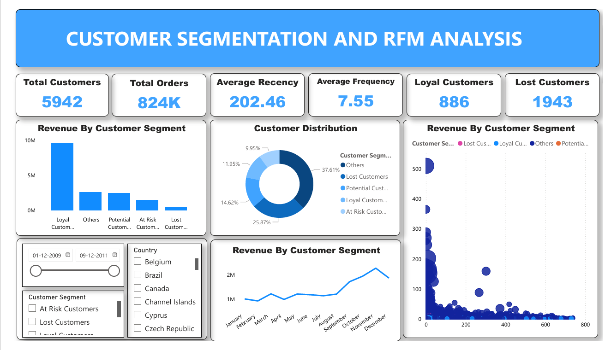

# 📊 Customer Segmentation & RFM Analysis

## 📌 Project Overview

This project analyzes customer purchasing behavior using RFM (Recency, Frequency, Monetary) analysis to segment customers and generate actionable business insights. The dashboard helps identify high-value customers, lost customers, and opportunities to improve retention.

---

## 🛠 Tools & Technologies

* Power BI (Dashboard & Visualization)
* Excel (Dataset)
* Data Cleaning & Transformation (Power Query)

---

## 📂 Dataset

* Online retail transaction dataset
* Contains customer purchase history including invoice, quantity, price, and country

---

## 📊 Key Insights

* Total of **5,942 customers** with over **824K orders** analyzed
* **Loyal customers (886)** contribute the highest share of revenue
* A significant number of customers (**1,943**) are lost, indicating retention challenges
* Average purchase frequency is **7.55**, showing moderate customer engagement
* Revenue shows a **steady increasing trend over time**
* Customer segmentation reveals strong potential to convert **at-risk customers into loyal customers**

---

## 💡 Business Recommendations

* Implement targeted campaigns to **re-engage lost customers**
* Develop strategies to **retain at-risk customers**
* Strengthen loyalty programs for **high-value customers**
* Focus marketing efforts on regions with **high purchase frequency**

---

## 📷 Dashboard Preview

---

## 📁 Files Included

* `Customer_segmentation_dashboard.pbix` – Power BI dashboard
* `Online_retail.xlsx` – Dataset used for analysis
* `dashboard.png` – Dashboard preview image

---

## 🚀 How to Use

1. Download the `.pbix` file
2. Open it using Power BI Desktop
3. Explore different filters (date, country, customer segments)
4. Analyze customer behavior and insights

---

## 📌 Conclusion

This project demonstrates how customer segmentation using RFM analysis can help businesses understand customer behavior, improve retention, and increase revenue through data-driven decisions.
