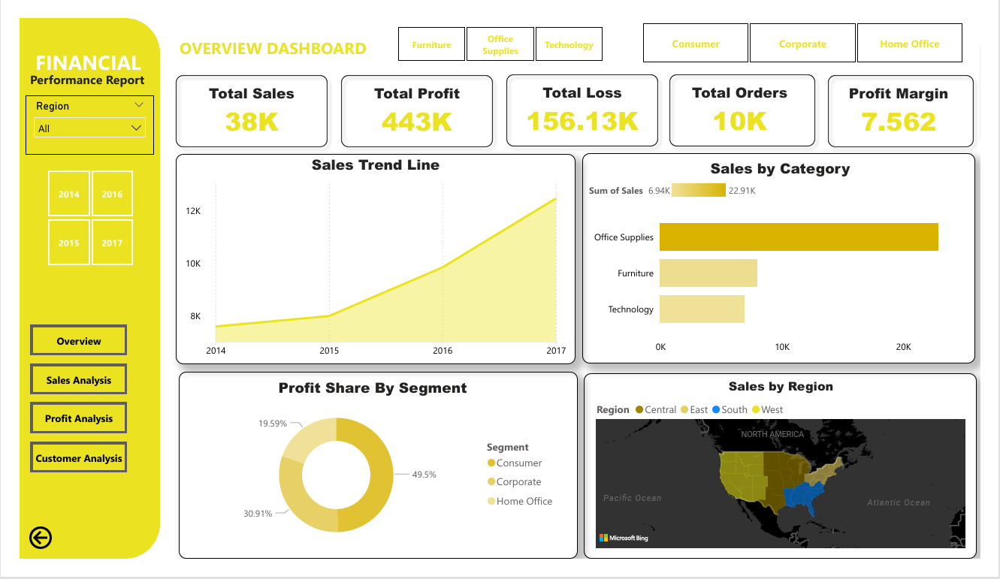
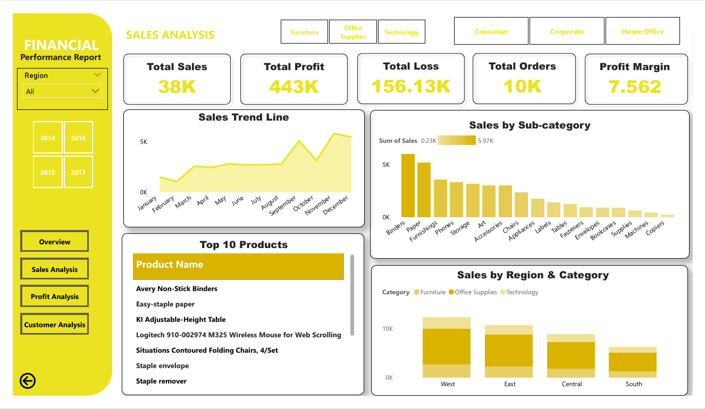
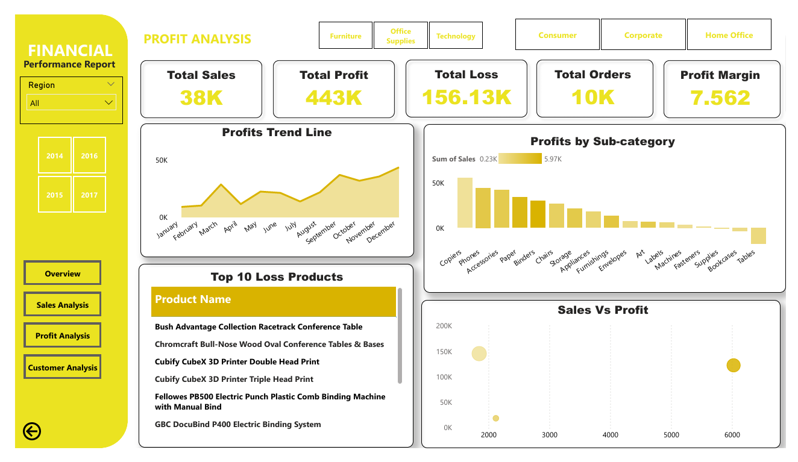
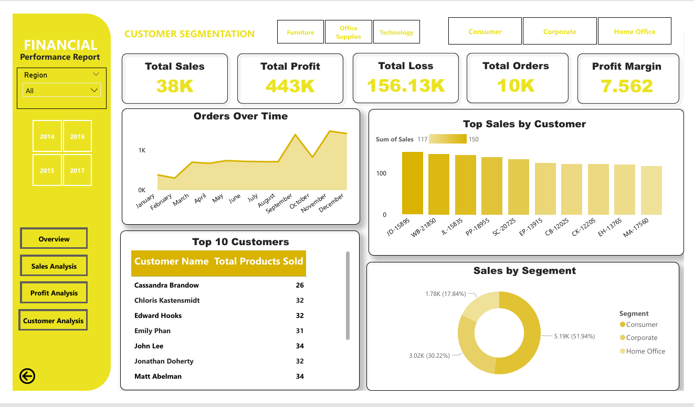

# 📊 Financial Performance Dashboard (Power BI)

## 📌 Project Overview

This project presents a comprehensive financial performance analysis using Power BI. It provides insights into sales, profit, loss, and customer segmentation across different regions, categories, and time periods to support data-driven business decisions.

---

## 🛠 Tools & Technologies

* Power BI (Dashboard & Visualization)
* Excel (Dataset)
* Power Query (Data Cleaning & Transformation)

---

## 📂 Dataset

* Financial sales dataset containing:

  * Orders, Sales, Profit, and Loss
  * Customer segments (Consumer, Corporate, Home Office)
  * Product categories and regions

---

## 📊 Key Insights

* Total sales reached **38K** with a total profit of **443K** and loss of **156.13K** 
* Profit margin stands at **7.56%**, indicating moderate profitability
* **Consumer segment contributes ~51.94%** of total sales, making it the largest segment
* Sales show a **consistent upward trend from 2014 to 2017**
* **Office Supplies category generates the highest sales** compared to Furniture and Technology
* Certain products contribute significantly to losses, highlighting inefficiencies
* Regional analysis shows variation in sales performance across Central, East, South, and West regions

---

## 📈 Dashboard Features

* KPI cards: Total Sales, Profit, Loss, Orders, Profit Margin
* Sales trend analysis (Year-wise & Monthly)
* Category and sub-category performance
* Profit analysis and loss-making products
* Customer segmentation analysis
* Region-wise sales visualization

---

## 💡 Business Recommendations

* Focus on reducing losses from underperforming products
* Improve profitability by optimizing high-loss categories
* Target **Consumer segment** for growth and retention
* Expand strategies in high-performing regions
* Strengthen pricing and cost control strategies

---

## 📷 Dashboard Preview

---

## 📁 Files Included

* `Financial Dashboard.pbix` – Power BI dashboard
* `dataset.xlsx` – Dataset used for analysis
* `dashboard.png` – Dashboard preview image

---

## 🚀 How to Use

1. Download the `.pbix` file
2. Open in Power BI Desktop
3. Use filters (Region, Year, Category, Segment)
4. Explore insights and trends

---

## 📌 Conclusion

This project demonstrates how financial data can be transformed into actionable insights using Power BI. It helps businesses understand performance trends, identify loss areas, and improve decision-making through interactive dashboards.

